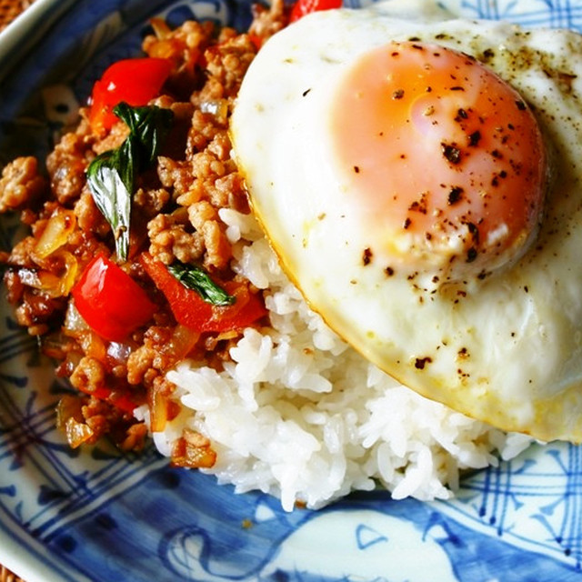

# GAPAO RICE

## Ingredients
- ごはん(タイ米)
- 鶏ひき肉
- パプリカ
- ピーマン
- バジル
- にんにく
- 豆板醤
- サラダ油
- 卵
- 飾り用バジル

[調味料]
- ナンプラー
- オイスターソース
- 酒
- 砂糖

- 油
- 卵
- 飾り用バジル

## Step1
ピーマンとパプリカは長さを揃えて細切りに、玉ねぎは縦に薄くスライスします。にんにくはみじん切りにします。調味料を合わせておきます。

## Step2
フライパンにサラダ油を引き、目玉焼きを作ります。お好みの硬さになったら取り出します。

## Step3
油はそのままでにんにくと豆板醤を加えて炒めます。香りが立ってきたら鶏ひき肉を炒めます。色が変わってきたら、野菜を加えて炒めます。

## Step4
火が通ってきたら(調味料)の合わせ調味料を加えて汁気が落ち着くまで炒めます。最後にちぎったバジルを加えてさっと炒めます。

## Step5
ごはんと盛り付けて目玉焼きを乗せたら完成です✨✨

## Step EX
ビールと一緒に🍺
パクチートッピングも！

テスト

