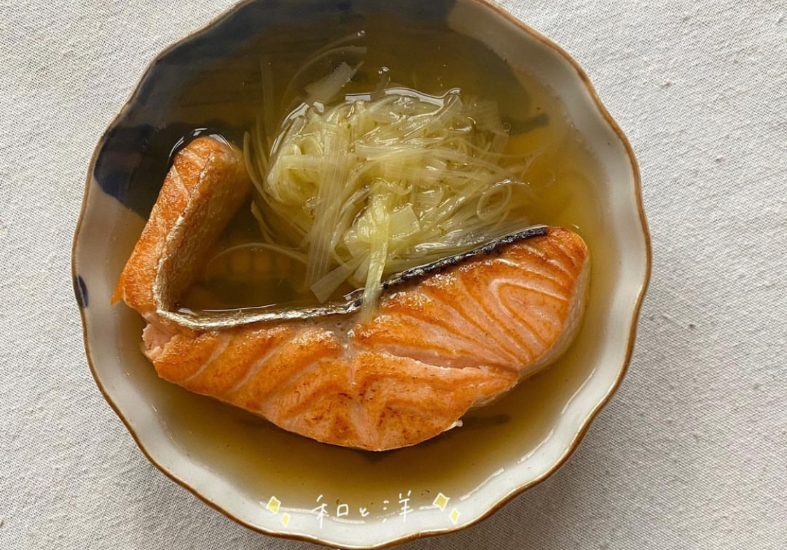

# Salmon mizore-ni

（(イメージはこんな感じ)）

## Ingredients
- サーモンの切り身
- きのこ
- 大根おろし
- 茄子
- 出汁
- 三つ葉

## Step1
サーモンを焼く。

## Step2
茄子ときのこは好きな大きさに切って、素揚げする。

## Step3
出汁を取る。

## Step4
出汁に大根おろしを入れてひと煮立ちさせる。その後、めんつゆで味を整える。

## Step5
お皿に、焼いたサーモン、素揚げした野菜を並べる。
その後、④を浸るくらいかける。

## Step6
最後に三つ葉をのせて完成!✨✨✨

